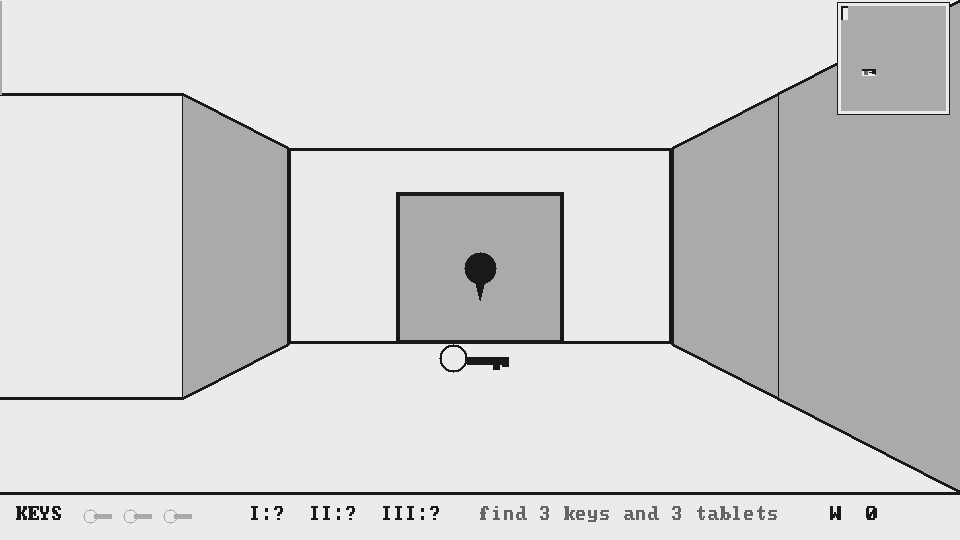

# Maze 3D — a first-person maze game on e-paper

A randomly generated maze seen in one-point perspective, drawn as bold
line art with the panel's four grey levels. You move one cell at a time —
turn, step, turn — and every move is a single full render, which is the
delta engine's favourite food: only the pixels that changed get driven,
so each step lands on the glass in a snap.

## The game

Somewhere in the maze stands a stone door with a keypad. To get out you
need:

- **3 brass keys** — they open the three locked wooden doors barring the
  deeper parts of the maze (walk into a locked door with a key and it
  unlocks).
- **3 stone tablets** — each is chiselled with one digit of the exit
  code. Walk over one to read it; the digits collect in the bar at the
  bottom of the screen.

Everything is placed so the maze is always solvable: each key lies in the
region of the maze its own door closes off, and the exit is the farthest
cell from where you start. A fog-of-war automap in the top corner records
where you've been; locked doors and the exit appear on it once seen.
Escape and your step count is totted up; a tap starts a fresh maze —
every maze is generated at random, no two games alike.

## Controls

**Touch** (GT911, both supported boards —
[GT911 Lite](https://github.com/tonywestonuk/gt911-arduino) library
required):

- left / right third of the screen — turn
- centre — step forward (or unlock / open what's in front of you)
- centre, near the bottom — step back
- keypad and win screen — tap what you see

**Serial** (115200): `a`/`d` turn, `w` forward, `s` back, digits on the
keypad, `x` cancel, `n` new maze.

## Build

Requires **Adafruit GFX** and **GT911 Lite**. Pick your board preset at
the top of `maze_3d.ino` (or leave auto-detect), flash, play. The panel
gets a full clear every 20 moves to sweep away ghosting; tune
`DEGHOST_MOVES` to taste.

## Code layout

- `maze_3d.ino` — hardware glue: display, touch, input mapping, paint.
- `maze_core.h` — everything else: maze generation (recursive
  backtracker plus a few loops), door/key/tablet placement with a
  solvability guarantee (BFS regions), the perspective renderer, automap,
  HUD, keypad and win screen. It is templated on the GFX type and has no
  Arduino dependencies, so it compiles on a desktop against a stub
  canvas — handy for previewing renders as images without flashing
  (that's how the screenshot above was made).

Lines are drawn 3px thick throughout (2px on the automap): single-pixel
hairlines all but vanish on e-paper at arm's length.
